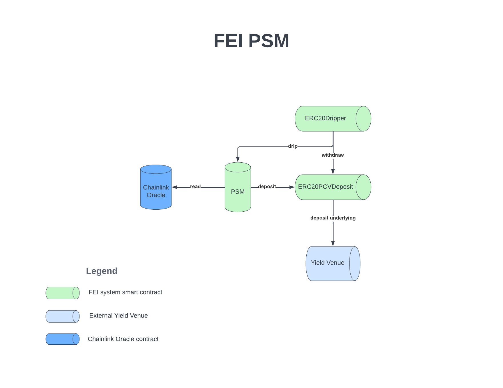

# Peg stability module
The Peg Stability Module (PSM) is responsible for helping the FEI protocol keep its peg at $1. The PSM is a stability mechanism, that is used to bring other existing liquidity venues back to the peg.

The FEI PSM is a contract which holds a reserve of assets in order to exchange FEI at $1 of other assets with a fee. There are two allowed actions `mint()` - buy FEI for $1 of assets plus a fee and `redeem()` - sell FEI back for $1 of assets, minus a fee. The current PSM's external asset is DAI so on mint, a user provides DAI, and the protocol gives FEI. On redeem, the user provides FEI, and receives DAI.

The contract has a reservesThreshold of external assets meant to stand ready for redemptions. The PSM has a reserve threshold, which is the maximum target amount of asset to hold. Any assets above the reserve threshold can be sent into the PCV using `allocateSurplus()`.

The contract implements the following interfaces:
 * PCVDeposit - to track reserves and balances
 * OracleRef - to determine price of the asset
 * RateLimitedMinter - to stop infinite mints and related issues.

The PSM currently charges the following fees:
* 0 basis point fee on mint to incentivize building up DAI reserves
* 10 basis point fee on redeem

Previous iterations of the PSM used an oracle to determine the DAI price. The newest PSM currently in use for DAI is a fixed price PSM and trades like DAI and FEI are always $1 and only uses the oracle to determine if the price of DAI is outside of the acceptable trading range. If the price of DAI is below $0.975 or above $1.025, then the PSM will shut down and disable trading while the price is outside of the acceptable range.

A newer iteration of the PSM is the non custodial PSM which removes the dripper, and instead grants the PSM the PCV Controller role. This non custodial PSM is much more capital efficient as it has no reserves threshold and stores all external assets in the ERC20PCVDeposit where they are then deposited into the yield venue. This architecture stops capital from sitting idly in the PSM and instead puts it all to work immediately.

The PSM makes several assumptions in its architecture, mainly that FEI is always $1 as there is never any oracle calls to check on the FEI price. The PSM also assumes that the PCVDeposit the ERC20Dripper pulls from has enough funds to refill it. The PSM requires the minter role to generate new FEI on mint actions.

## PSM Architecture Diagram
